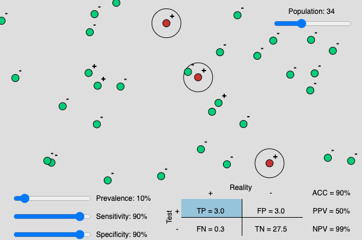

# Interactive diagnostic test statistics

I used P5.js to make an [interactive appicaltion](https://wytamma.github.io/interactive-diagnostic-test-statistics/index.html) to unterstand diagnostic test statistics.

More information can be found [here](https://en.wikipedia.org/wiki/Sensitivity_and_specificity#Confusion_matrix).

